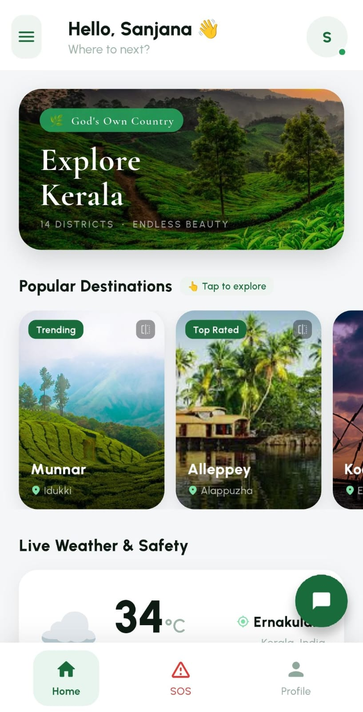
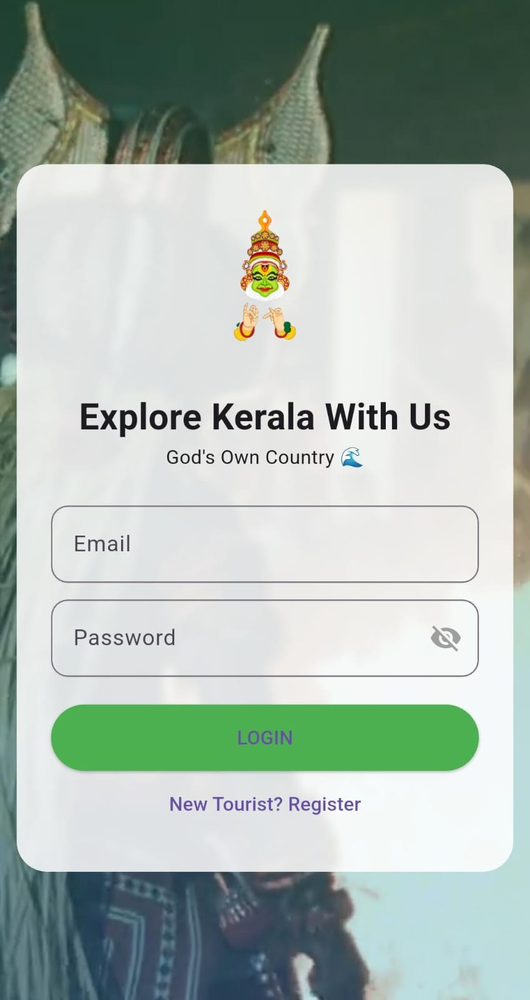
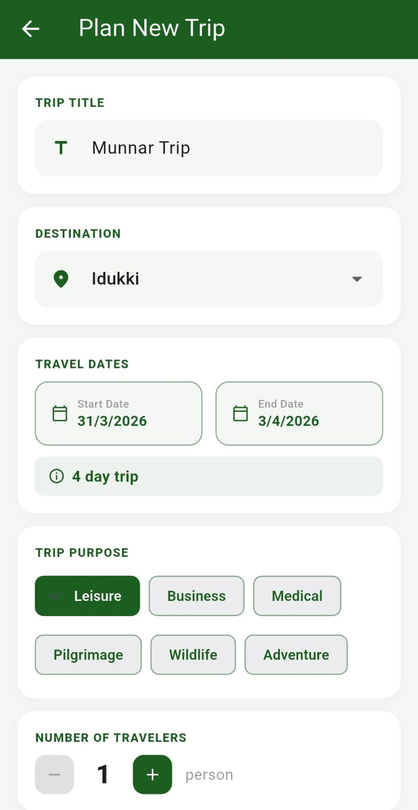
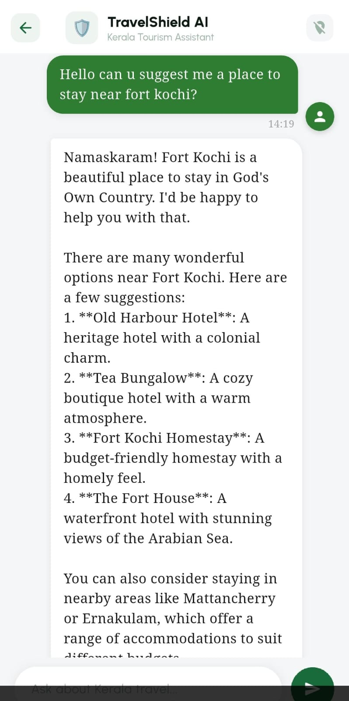
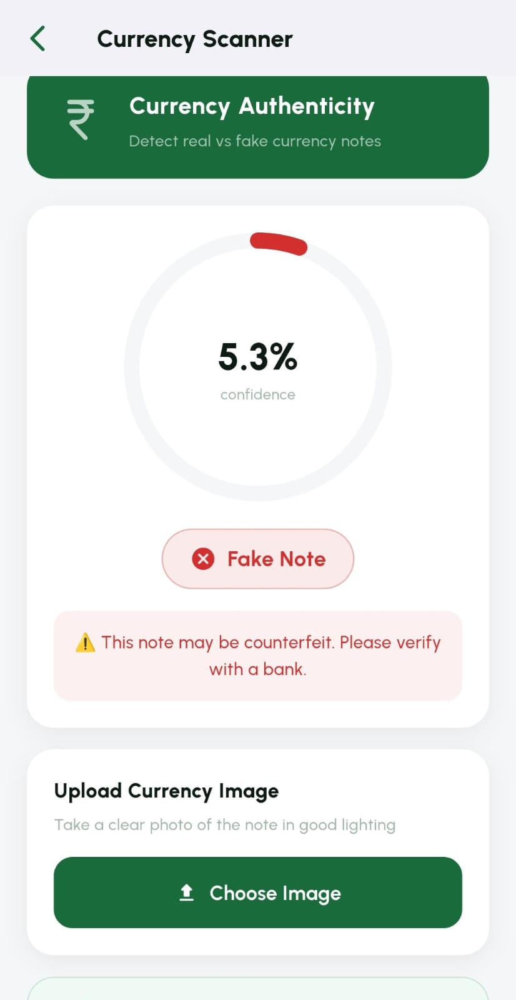
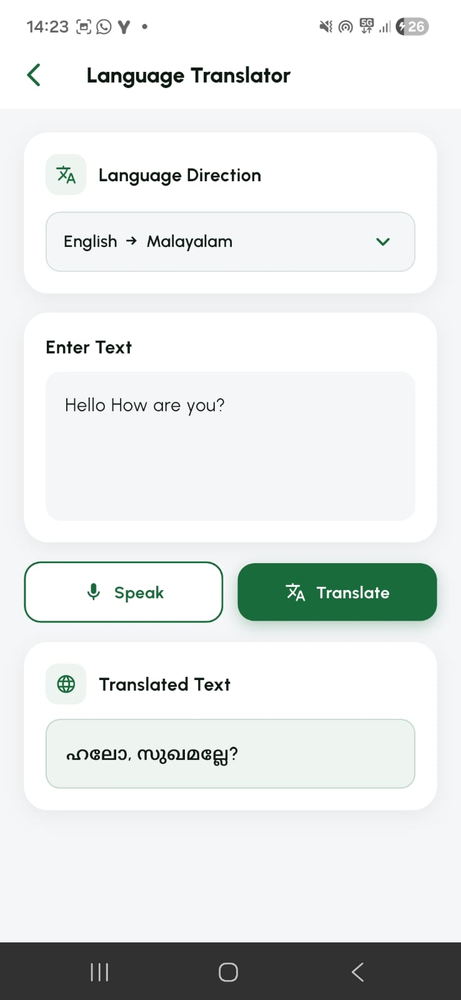
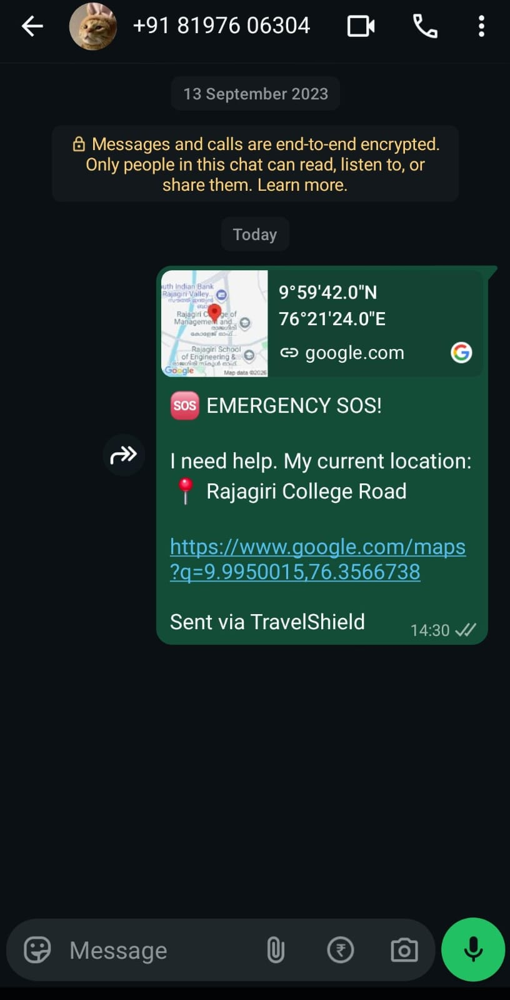

# TravelShield

<p align="center">
  
</p>

<h3 align="center">
AI-Powered Smart Travel Assistant for Tourists Visiting Kerala
</h3>

<p align="center">
TravelShield is an intelligent mobile application that combines Artificial Intelligence, Machine Learning, and Location-Based Services to provide a safer, smarter, and more convenient travel experience across Kerala.
</p>

---

## About

TravelShield is a Flutter-based mobile application developed as an academic project to assist tourists visiting Kerala. The application integrates intelligent trip planning, emergency assistance, counterfeit currency detection, QR code security, multilingual communication, and real-time travel alerts into a single platform.

The objective of TravelShield is to enhance tourist safety while simplifying travel planning and communication through AI-powered services.

---

## Features

### AI Travel Assistant

- AI-powered chatbot for travel guidance
- Tourist information and destination recommendations
- Interactive travel assistance

### AI Trip Planner

- Personalized itinerary generation
- Day-wise travel schedules
- Budget-aware travel planning
- Smart destination recommendations

### Fake Currency Detection

- Detect counterfeit Indian currency notes
- CNN-based deep learning model
- Image-based prediction

### QR Code Security Scanner

- Secure QR code scanning
- Detection of malicious QR codes
- Protection against phishing links

### English–Malayalam Translator

- Bidirectional translation
- Voice input support
- Improved communication with local residents

### Overpricing Checker

- Verify transportation fares
- Compare prices with standard rates
- Help prevent tourist overcharging

### Emergency SOS

- One-tap emergency assistance
- Live GPS location sharing
- Nearby police stations
- Nearby hospitals
- Emergency contact support

### Weather and Clothing Suggestions

- Live weather updates
- Clothing recommendations based on weather conditions

### District-wise Travel Alerts

- Kerala tourism news
- District-specific safety alerts
- Travel advisories

### Secure User Management

- User registration and login
- Email OTP verification
- JWT authentication
- Secure profile management

---

## Application Screenshots

### Login

<p align="center">

</p>

### Home Dashboard

<p align="center">

</p>

### AI Trip Planner

<p align="center">

</p>

### AI Chatbot

<p align="center">

</p>

### Fake Currency Detection

<p align="center">

</p>

### Translator

<p align="center">

</p>

### Travel Alerts

<p align="center">

</p>

---

## Technology Stack

### Mobile Application

- Flutter
- Dart

### Backend

- FastAPI
- Python

### Artificial Intelligence

- TensorFlow
- Convolutional Neural Networks (CNN)
- Groq LLM

### Database

- SQLite

### APIs and Services

- Google Maps API
- GNews API
- Weather API
- GPS and Location Services

### Security

- JWT Authentication
- bcrypt Password Hashing
- OTP Verification
- flutter_secure_storage

---

## System Architecture

```text
                 Flutter Mobile Application
                           │
                           ▼
                  FastAPI Backend Server
                           │
      ┌──────────────┬──────────────┬──────────────┐
      │              │              │
      ▼              ▼              ▼
 AI Services     ML Models     External APIs
      │              │              │
      ▼              ▼              ▼
 Chatbot       Currency CNN    Google Maps API
 Translator    QR Detection    Weather API
 Planner                       GNews API
```

---

## Project Structure

```text
TravelShield
├── backend
├── travel_app
├── docs
├── assets
│   └── screenshots
├── README.md
└── DEVELOPER_GUIDE.md
```

For detailed setup instructions, deployment steps, development workflow, and API configuration, refer to **DEVELOPER_GUIDE.md**.

---

## Getting Started

### Clone the Repository

```bash
git clone https://github.com/sanjana0934/TravelShield.git
cd TravelShield
```

### Backend Setup

```bash
cd backend

python -m venv tf_env

# Windows
tf_env\Scripts\activate

# Linux/macOS
source tf_env/bin/activate

pip install -r requirements.txt

uvicorn main:app --reload
```

Backend URL

```
http://localhost:8000
```

API Documentation

```
http://localhost:8000/docs
```

### Flutter Setup

```bash
cd travel_app

flutter pub get

flutter run
```

---

## Security Features

- JWT Authentication
- Password Hashing using bcrypt
- Email OTP Verification
- Secure Token Storage
- Session Expiry Management
- Rate Limiting
- Secure User Profiles

---

## Key Highlights

- AI-powered travel assistance
- Intelligent itinerary generation
- Counterfeit currency detection
- Secure QR code scanning
- Emergency SOS services
- Live weather updates
- District-wise travel alerts
- English–Malayalam translation
- Secure authentication
- Modern Flutter user interface

---

## Future Enhancements

- Offline travel support
- Voice-enabled AI assistant
- Public transport integration
- Government tourism services integration
- Personalized travel recommendations
- Support for additional Indian languages

---

## Documentation

Detailed setup instructions, deployment guide, API configuration, environment variables, and development workflow are available in **DEVELOPER_GUIDE.md**.

---

## Contributors

This project was collaboratively developed by:

- Neha KS
- Sanjana M Paul
- Rayaan Ann George
- Sancia Susan Abraham

---

## License

This project was developed as an academic project for educational purposes.

---

<p align="center">
Developed using Flutter, FastAPI, TensorFlow, and Artificial Intelligence.
</p>
